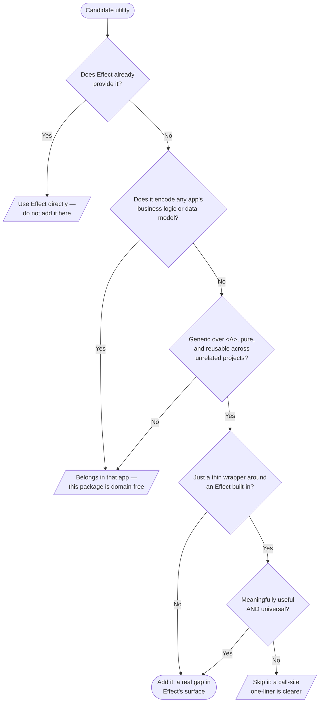

# effect-extras — agent guide

`CLAUDE.md` is a symlink to this file. Source of truth.

When you update this file, **rewrite the affected section cohesively** — don't append patches to
the bottom. The next reader (human or agent) should be able to scan a section top-to-bottom and
understand it without archaeology.

---

## What this repo is

`@nunofyobiz/effect-extras` is a **single published npm package** of generic, framework-agnostic
extensions to the [Effect](https://effect.website) standard library — the `*X` modules (`ArrayX`,
`OptionX`, `RecordX`, `StructX`, …). Other projects depend on it; `effect` is its only peer
dependency.

The defining constraint: **no app, no framework, no domain code lives here.** Everything is pure,
generic, and universal. That constraint is the product — guard it.

> [!IMPORTANT]
> **The single most important section in this guide is [What belongs here](#what-belongs-here).** It
> is the prime directive that governs _every_ change an agent makes in this repo: before you add,
> modify, or extract any utility, confirm it belongs. When that section conflicts with convenience —
> or with anything else written here — it wins. If you read nothing else, read it.

## Package manager

**pnpm only.** Never npm, never yarn, never bun. The lockfile is `pnpm-lock.yaml`.

If `pnpm` is not found, escalate in this exact order — do not chain them:

1. Run the command as-is. If it works, stop.
2. Run `nvm use` (reads `.nvmrc`). Try again.
3. Run `source ~/.nvm/nvm.sh && nvm use`. Try again.
4. Only if all three fail, ask the user.

Do **not** prepend `cd /path/to/repo` to pnpm commands — pnpm respects the current working
directory, and chaining `cd && pnpm` triggers permission prompts unnecessarily.

## Node version

Pinned in `.nvmrc` to **24.15.0** for development. The published `engines.node` floor is `>=22`,
and CI typechecks + tests on Node **22 and 24** to keep that promise honest. Don't raise the floor
without an open discussion.

## Verification ritual

Before claiming a task done, run **`pnpm check-all`**. It runs, in order:

1. `pnpm tc` — `tsc --noEmit` (src + tests)
2. `pnpm lint` — ESLint flat config (formatting included via `eslint-plugin-prettier`; no separate
   Prettier step)
3. `pnpm test` — Vitest (`@effect/vitest`)
4. `pnpm build` — `tsc` + `babel` (ESM, one output file + `.d.ts` per module, with
   `/*#__PURE__*/` annotations — see [Tree-shaking & packaging](#tree-shaking--packaging))
5. `pnpm publint` — `publint`: validates the published packaging (`exports` map, `types` conditions,
   ESM correctness) against `dist/` (needs a prior `build`)
6. `pnpm treeshake` — `size-limit`: enforces the per-function tree-shaking byte budgets in
   `.size-limit.json` (needs a prior `build`)
7. `pnpm knip` — unused files / exports / deps
8. `pnpm docgen` — `@effect/docgen`: type-checks every JSDoc `@example` (via `tsx`) and regenerates
   the API docs under `docs/` from the source

While iterating, run the individual checks (faster). CI mirrors these as one job per check, plus:
`commitlint` on PR commits, a `renovate-config-validator --strict` job, a `pack --dry-run`
that catches `files` / tarball misconfigurations before a real release (it uses `pnpm pack`, not
`publish --dry-run`: the latter computes a dist-tag against the live registry and errors once the
package is published, since every non-release branch sits at an already-published version), and the
`publint` + `treeshake` jobs above (each builds first, then runs the check). The `docgen` CI job runs
read-only (`contents: read`): it regenerates the docs and then fails on `git diff --exit-code docs/`
if the committed `docs/` drifted — it never writes back or opens PRs. Keeping `docs/` current is the
author's job locally (the pre-commit hook automates it; see below), so the committed docs that
GitHub Pages serves always match the source.

## What belongs here

**This is the most important section in this guide — the prime directive for any work in this
repo.** It is the whole job of the package and the one decision you'll make most often. The package's
entire value is its restraint: a "utils" grab-bag that accretes whatever is convenient is worse than
no package at all. So before you add, change, or extract anything, it must clear this bar. A utility
belongs here only if **all** of these hold:

1. **It is not already in Effect.** If `effect` (or an `@effect/*` package) already does it, use
   that. The built-in modules (`Array`, `Option`, `Record`, `Predicate`, `String`, `Number`,
   `Order`, `Result`, `Match`, `Struct`, …) are wide — check the [docs](https://effect.website)
   first.
2. **It is generic and pure.** Operates on type parameters (`<A>`), no side effects, no mutations,
   and would make sense in a project that shares nothing with yours.
3. **It carries zero app knowledge.** It never references a business domain or data model
   (`Project`, `User`, `Timeline`, …) and never encodes product rules. **This is the hard line** —
   domain-shaped helpers live in the app that owns the domain.
4. **A thin wrapper around Effect built-ins must earn its place.** Only add one when it is
   _meaningfully useful_ **and** _universal_. If a one-liner at the call site is just as clear,
   don't wrap it.



**Does NOT belong:** anything tied to a domain model / DB row / API shape / product copy; anything
importing a framework or assuming a runtime; a wrapper that just renames an Effect function or
saves one obvious line; or a control-flow combinator Effect already ships (`sequence`, `when`,
`unless`). Extend Effect's _data_ surface, not its control flow.

When unsure, leave it at the call site. A helper graduates into this package the moment a
**second, unrelated** call site wants the same generic shape — not before.

## The `*X` module + barrel pattern

Each module is a **single flat file** under `src/` — the same layout as Effect itself (`src/Array.ts`,
`src/Option.ts`, …):

```
src/
  ArrayX.ts           # implementation: flat `export const …` helpers
  ArrayX.test.ts      # exhaustive tests
  …
  index.ts            # root barrel: export * as ArrayX from "./ArrayX.js"; (one line per module)
```

- Each module file exports its helpers **flat** (`export const compactNullable = …`). It is _not_
  wrapped in a namespace — that is what lets a consumer's bundler tree-shake **per function**.
- The root `src/index.ts` forms the namespace: `export * as ArrayX from "./ArrayX.js";` (one line per
  module). A module with a top-level named export (e.g. `NonNullableX`'s `nn`) adds a line for it too:
  `export { fromNullableOrThrow as nn } from "./NonNullableX.js";`.
- Imports carry an **explicit `.js` extension** (`import * as RecordX from "./RecordX.js";`) — the
  build is raw `tsc` emit (no bundler to rewrite specifiers), so Node's ESM resolver needs the real
  extension. Modules import each other by **relative path**, never by the package name; that's why no
  `src/` file references `@nunofyobiz/effect-extras`.
- A module that needs another module's helpers imports it as a **namespace** (`import * as RecordX
from "./RecordX.js"` → `RecordX.foo`), mirroring how a consumer would.
- Adding a module = new `src/FooX.ts` (+ `src/FooX.test.ts`) + one `export * as FooX from "./FooX.js";`
  line in `src/index.ts`. The subpath export and size budget are wildcard/automatic — no per-module
  wiring in `package.json` or `.size-limit.json` (see below).

## Tree-shaking & packaging

The package must stay tree-shakeable down to the **function**: a consumer importing one helper gets
one helper's worth of code, not the module and not the library. This is the **same build Effect
uses**. Four things hold the line — change any and shaking silently coarsens, so the `publint` +
`treeshake` checks gate them:

- **Flat exports, no namespace wrapper in the shipped file.** Each `dist/ArrayX.js` is plain
  `export const … = /*#__PURE__*/ …`. The namespace (`ArrayX.*`) is formed only by `import * as` (the
  root barrel, or a consumer's subpath import). A pre-built namespace **object** (esbuild's
  `__export(NS, { getter, … })`) pins every member and defeats per-function shaking — never reintroduce
  one (e.g. by bundling, or by adding a per-module `index.ts` that the subpath points at).
- **`tsc` compile + `babel annotate-pure-calls`, not a bundler.** `pnpm build` runs `tsc -p
tsconfig.build.json` (emits `dist/ArrayX.js`, `dist/index.js`, `.d.ts`, maps — one file per source,
  specifiers preserved) then `babel dist --plugins annotate-pure-calls`, which stamps `/*#__PURE__*/`
  on every top-level call so a consumer's bundler can drop unused `export const`s. A bundler (tsup/
  esbuild) would re-introduce the `__export` getter objects above — don't switch back.
- **`"sideEffects": false`** in `package.json` — lets bundlers drop the side-effect-free modules.
  Every helper here is pure, so this stays true; never add module-level side effects. (Safe alongside
  the pure annotations: `annotate-pure-calls` only marks the value-producing calls, not the bare
  `export *` statements.)
- **Subpath exports.** `package.json` `exports` maps `"./*"` → `./dist/*.js` (+ matching `types`), so
  `@nunofyobiz/effect-extras/ArrayX` resolves to that one flat module file — `import * as ArrayX` (or
  `import { compactNullable }`) shakes per function regardless of the consumer's bundler. The wildcard
  auto-covers new modules; `"./index": null` blocks the redundant `…/index` path.

Granularity: a **subpath** import (`import * as ArrayX from "…/ArrayX"`) tree-shakes **per function**;
the **root barrel** (`import { ArrayX } from "…"`) shakes unused _modules_ away but keeps a touched
module whole — the same `export * as` trade-off Effect's root re-export makes. Point consumers who
care at the subpath. The validators:

- **`publint`** (`pnpm publint`) lints the packaging config against the built `dist/` — that every
  `exports` target resolves, `types` are present, ESM is well-formed.
- **`size-limit`** (`pnpm treeshake`, config in `.size-limit.json`) enforces byte budgets on representative
  imports (single function, whole module, barrel, whole library), with `effect` externalized
  (`ignore: ["effect", "effect/*"]`) so we measure only this package. The budgets are set so that a
  tree-shaking regression — a single-function import ballooning toward the module or library size —
  trips the limit. Re-measure and bump a limit only for genuine, intended growth; a sudden jump means
  shaking broke, so fix the build, don't raise the budget.

## Effect v4 conventions

This package targets **Effect v4** (`effect@beta`), its sole peer dependency. A few v4-isms to keep
straight when copying snippets from older Effect docs:

- **`Result` replaced `Either`.** `Either.right(x)` → `Result.success(x)`; `Either.left(e)` →
  `Result.failure(e)`. There is no `Either` alias in v4.
- **Schema checks compose with `.check(...)`**, not piped refinements:
  `Schema.Number.check(Schema.greaterThan(0))`, not `Schema.Number.pipe(Schema.positive())`.
- **Don't re-implement Effect's control-flow combinators.** Effect ships `Effect.if`, `Effect.when`,
  `Effect.unless`, `Effect.forEach`, `Effect.all` — use them. This package extends Effect's **data**
  surface (`ArrayX`, `RecordX`, `StructX`, …), never its control flow.

## Effect patterns

Conventions for _how_ to write Effect code here. Apply them on every change that touches Effect, not
just net-new files — consistency is what lets the utilities read as one library.

### Match over if/else

Use `Match.value` / `Match.valueTags` / `Match.tagsExhaustive` instead of `if/else` chains or
`switch`. `Match.exhaustive` makes the compiler enforce exhaustiveness — add a variant to a union
and every match site fails to compile until it handles the new case.

```ts
import { Match } from "effect";

// Discriminated union — exhaustive over the tag
const summary = Match.value(these).pipe(
  Match.tag("Both", (both) => `both ${both.left}/${both.right}`),
  Match.tag("This", (self) => `this ${self.left}`),
  Match.tag("That", (that) => `that ${that.right}`),
  Match.exhaustive,
);

// Plain values
const exitCode = Match.value(status).pipe(
  Match.when("clean", () => 0),
  Match.when("drift", () => 1),
  Match.exhaustive,
);
```

Short ternaries and `??` are fine: `const name = config.name ?? "unnamed"`. For the success/failure
split on an Effect, `Effect.matchEffect` is the Effect-level equivalent.

### Predicates for type checks

Use predicates from Effect modules instead of manual `=== null`, `typeof`, or `.length > 0`:

```ts
import { Predicate, String, Number, Array } from "effect";

if (Predicate.isNotNullable(value)) { ... } // not: value != null
if (Predicate.isString(value)) { ... } //      not: typeof value === "string"
if (String.isNonEmpty(str)) { ... } //         not: str.length > 0
if (Array.isNonEmptyArray(arr)) { ... } //     not: arr.length > 0
if (Number.isFinite(n)) { ... }
```

A compound predicate worth reusing (an `isNonEmptyString` combining `isNotNullable`, `isString`, and
`String.isNonEmpty`) is exactly what `PredicateX` is for — create it the first time a second call
site wants it.

### Dual functions

When a function supports both piped and direct call styles, use `dual` from `effect/Function` (not
`Function.dual()`). Declare the **data-last** (piped) overload first, then **data-first**:

```ts
import { dual } from "effect/Function";

export const withPrefix = dual<
  (prefix: string) => (id: string) => string, // data-last: pipe(id, withPrefix("x:"))
  (id: string, prefix: string) => string //      data-first: withPrefix(id, "x:")
>(
  2, // arity of the data-first overload
  (id, prefix) => `${prefix}${id}`,
);
```

Most helpers here that take a "data" argument are `dual` — that's what lets them sit naturally in a
consumer's `pipe` chain _and_ be called directly.

### Data-first vs `pipe`

Prefer **data-first** for single calls; use `pipe()` only when chaining 2+ operations.

```ts
// Good — data-first for single calls
Option.getOrElse(option, () => fallback);
Effect.map(effect, fn);

// Good — pipe for chains of 2+
pipe(
  option,
  Option.filter(predicate),
  Option.getOrElse(() => fallback),
);

// Bad — pipe wrapping a single call
pipe(
  option,
  Option.getOrElse(() => fallback),
);

// Good — pass a curried function directly (no wrapper lambda)
Option.flatMap(option, Schema.decodeUnknownOption(MyId));

// Bad — unnecessary lambda wrapping a single function call
Option.flatMap(option, (value) => Schema.decodeUnknownOption(MyId)(value));
```

### `Result` over custom discriminated unions

When a function returns "success or one of N typed failures", reach for `Result<A, E>` instead of a
hand-rolled discriminated union — it unlocks Effect's combinators (`Result.map`, `Result.match`,
`Result.getOrElse`) over manual `_tag` checks.

**Use `Result` when:** the success case carries data you want to transform and the failures are
finite and tagged. **A custom union is fine when** 3+ variants are all "equal" with no clear
success/failure split.

```ts
import { Result, Match } from "effect";

Result.match(parsed, {
  onSuccess: (value) => render(value),
  onFailure: Match.type<ParseError | RangeError>().pipe(
    Match.tag("ParseError", (error) => reportParse(error)),
    Match.tag("RangeError", (error) => reportRange(error)),
    Match.exhaustive,
  ),
});
```

### Quick reference

| Instead of                        | Use                                        |
| --------------------------------- | ------------------------------------------ |
| `if/else` chains                  | `Match.value` / `Match.valueTags`          |
| `=== null`                        | `Predicate.isNull`                         |
| `!= null`                         | `Predicate.isNotNullable`                  |
| `typeof x === "string"`           | `Predicate.isString`                       |
| `str.length > 0`                  | `String.isNonEmpty(str)`                   |
| `arr.length > 0`                  | `Array.isNonEmptyArray(arr)`               |
| `{ key: maybeUndefined }`         | `StructX.defined("key", maybeUndefined)`   |
| Custom `_tag` discriminated union | `Result<A, E>` + `Result.match`            |
| Inline `Array.prototype.sort`     | `Array.sort(arr, order)` — see Sort orders |

> `tsconfig.base.json` sets `exactOptionalPropertyTypes: true` (required by Effect Schema), so
> spreading `{ key: undefined }` into an object whose key is `key?: T` is a type error — the property
> must be _absent_, not present-but-undefined. `StructX` (`defined`, `filterDefined`, `some`) is the
> canonical fix.

## No type assertions

The `as` keyword is **avoided** outside of `as const`. When you reach for a cast, the right answer is
one of:

- `Schema.decode(...)` — for runtime-validated narrowing
- `Match.value(...)` with exhaustive cases — for discriminated unions
- a `Predicate.is*` refinement function — for type guards
- a `parseX(...): Effect<X, ParseError>` boundary function — for parsing external input

If none of those work, that's a sign the shape is wrong — discuss before reaching for `as`. The
strict ESLint config already bans `any` and unused eslint-disable directives, so casts are one of the
few escape hatches left; treat reaching for one as a design smell.

## FP mindset

This package _is_ the FP-mindset layer for its consumers: compose logic from generic utilities that
operate on generic data structures, so calling code declares _what_ to do while the utilities handle
_how_ to manipulate the data. Writing those utilities well is the entire job of the repo.

### Spotting reuse opportunities

A `pipe()` chain is a structural declaration: each step names an operation on a named data shape.
Reading chains this way — and applying the same lens to any loop, `reduce`, imperative accumulator,
or complex conditional — is how new utilities are discovered. Before writing inline transformation
logic, ask in order:

1. **Does Effect already cover this?** `Array`, `Option`, `Record`, `Predicate`, `String`, `Number`,
   `Order`, `Result`, `Match`, `Struct`, `Tuple`, `HashMap`, `HashSet`, … are wide and well-tested.
   Check the [Effect docs](https://effect.website/) when unsure.
2. **Does an existing `*X` module already do it?** (See "Check existing utilities first" below.)
3. **Can the logic be a generic utility another call site could reuse?**

If yes to any: use or extract it.

### Extracting from a pipe

When a cluster of 2–3 consecutive steps forms a recognizable transformation, that cluster is a
utility waiting to be named:

1. **Name it in the abstract** — strip the domain nouns; describe what the steps do to the data shape
   ("filter to present items, then group by key").
2. **Check Effect and the `*X` modules** — does an equivalent exist? If so, use it.
3. **If not, extract it** — a generic, `dual`-compatible function in the right `*X` module; replace
   the inline steps with one call; add exhaustive tests.

This is how the utility layer grows: not by upfront design, but by recognizing structure already
present in a pipe and giving it a name. (Not in tension with "don't re-implement Effect's control-flow
combinators" — that bans duplicating Effect's _control flow_; this is about _data-shape_ utilities,
which are the point of the repo.)

### Where utilities live

- **`effect`** (the library) — the first place to look. If `Array.foo` already does it, use it.
- **This package** — the shared home for generic Effect-extension `*X` modules. A helper belongs here
  only if it clears the [What belongs here](#what-belongs-here) bar (generic, pure, no domain
  knowledge).
- A helper used by only one consumer can start local to that consumer and graduate here the moment a
  **second, unrelated** consumer wants it.

### Check existing utilities first

Before writing a new helper, check whether one of the existing modules already covers it: `ArrayX`,
`BigIntX`, `BooleanX`, `DurationX`, `EffectX`, `FormDataX`, `InclusiveOr`, `MapX`,
`NonNullableX` (+ `nn`),
`NumberX`, `OptionX`, `OrderX`, `PredicateX`, `PromiseX`, `RecordX`, `ResultX`, `SchemaX`, `SetX`,
`StringX`, `StructX`, `WarnResult`. The [README Modules table](./README.md#modules) summarizes what each
covers.

### Designing a good utility

1. **Generic type parameters** — operate on `<A>`, not concrete types.
2. **Pure functions** — no side effects, no mutations.
3. **Support `dual`** when the utility takes a pipeable data argument.
4. **Follow the module/barrel pattern** — a flat `src/FooX.ts` (+ `src/FooX.test.ts`) + an
   `export * as FooX from "./FooX.js";` line in `src/index.ts`.
5. **Exhaustive test coverage** — every public function, every branch, edge cases (empty,
   single-element, boundary), and type-level correctness where the utility's whole point is type
   narrowing. Non-negotiable: these helpers are consumed by every layer above them, they outlive the
   surrounding code, and their tests are the only spec they have.

## Sort orders

Use Effect's `Order` module for type-safe, composable sorting — never an inline `Array.prototype.sort`
comparator.

### Named orders vs inline

If an ordering is a logical, reusable property of a type, define it as a named `Order.Order<T>` export
(PascalCase strategy name; add an `Asc`/`Desc` suffix only when both directions are exported). For a
one-off, sort inline:

```ts
import { Array, Order } from "effect";

const sorted = Array.sort(
  items,
  Order.mapInput(Order.string, (item: Item) => item.path),
);
```

### Key helpers

| Helper                              | Use case                              |
| ----------------------------------- | ------------------------------------- |
| `Order.mapInput(base, extract)`     | Sort objects by a field               |
| `Order.combine(primary, secondary)` | Multi-key sort (two orders)           |
| `Order.combineAll([o1, o2, …])`     | Multi-key sort (more than two orders) |
| `Order.reverse(order)`              | Flip ascending to descending          |
| `Array.sort(array, order)`          | Sort by a single order                |
| `Array.sortBy(o1, o2, …)`           | Sort by multiple orders combined      |

Specialized order helpers — ranking enum-like values (`OrderX.rankedEnum`) or pushing nulls last —
live in `OrderX` / `NonNullableX`. That's this repo's job in miniature: the moment you reach for one
inline, it belongs in a module instead.

## Tests

Exhaustive coverage per public function — every branch, edge cases (empty, single-element,
boundary), and type-level correctness where the helper's whole point is type narrowing. This is
non-negotiable: these utilities are consumed by every layer above them, they outlive the
surrounding code, and they have no domain context to specify them other than their tests. **The
tests are the spec.** Tests use `@effect/vitest`.

## Commits and PRs

- **Conventional Commits**, enforced by commitlint (body lines ≤ 200 chars for bot compatibility).
  Types: `feat`, `fix`, `refactor`, `chore`, `docs`, `test`, `perf`, `style`, `ci`, `build`.
  "Visible to a consumer of the library" is the lens for `feat`/`fix`; tooling/CI/deps are `chore`.
- **Atomic commits** — one cohesive change each; the package builds green on every commit.
- On an **unmerged feature branch**, amending / squashing / reordering is standing permission —
  keep the history clean. Update an open PR with `git push --force-with-lease` (never bare
  `--force`). Once a commit reaches `main`, it's history.
- Run `pnpm check-all` before pushing. PR title is itself a Conventional Commit.
- Skills: [`create-commit`](.claude/skills/create-commit), [`verify-commit`](.claude/skills/verify-commit),
  [`push-pr`](.claude/skills/push-pr), [`rebase-main`](.claude/skills/rebase-main).

**Pre-commit hooks (husky + lint-staged).** `pnpm install` runs the `prepare` script (`husky`),
which wires up two git hooks:

- **pre-commit** first regenerates the API docs when non-test `src/**/*.ts` is staged — it runs
  `pnpm docgen` and `git add docs/` so every source change commits up-to-date `docs/` (and a broken
  `@example` blocks the commit, the same gate CI enforces). Then it runs `lint-staged` — ESLint
  `--fix` (with the Prettier integration) on staged JS/TS, and `prettier --write` on staged
  Markdown / YAML / JSON5 / CSS. The `src` guard keeps docs-free commits fast (docgen is a
  whole-project, ~6–7s run).
- **commit-msg** runs `commitlint` against [commitlint.config.ts](./commitlint.config.ts) to enforce
  Conventional Commits.

If a hook blocks a commit, read the output, fix the surfaced issue, re-stage, and commit again —
don't bypass with `--no-verify`. CI re-runs commitlint on PRs as a backstop.

### Commit signing

**Agent commits in this repo are authored as a distinct "Claude Code" identity and signed** with a
dedicated SSH key, so they land under a separate author with GitHub's green **Verified** badge — kept
apart from the human contributor's normal name and key. You (the agent) don't decide any of this —
git does it because the agent identity is configured for your worktree, and
[`scripts/setup-signing.sh`](./scripts/setup-signing.sh) keeps it in place. You should never need a
reminder.

How it stays configured without anyone remembering: the `SessionStart` hook in
[`.claude/settings.json`](./.claude/settings.json) runs `bash scripts/setup-signing.sh` at the start
of every agent session. On a `claude/*` or `agent/*` branch it copies the agent identity
(`user.name`, `user.email`, `user.signingkey`, `gpg.format`, `gpg.ssh.allowedSignersFile`,
`commit.gpgsign=true`) from `~/.gitconfig.claude` into the **worktree** config (via
`extensions.worktreeConfig`) — which sits above local `.git/config`, so it overrides the human
identity + key only inside this agent worktree. It's idempotent; on any other branch (`main`,
`feature/…`) it exits early and your normal identity applies. If you ever see an unsigned commit, the
wrong author, or git complaining about `user.signingkey`, run `bash scripts/setup-signing.sh`
directly — it's safe any time.

This adopts StoryCut's model: the **author** becomes `Claude Code (<contributor>)` — same email as
your normal commits (typically the GitHub noreply form), only the name differs — distinguishing agent
commits from yours without needing a separate verified email. No identity or key material is baked
into the script; it all comes from `~/.gitconfig.claude`. If that file is missing the script prints a
hint and exits 0 (never blocking a session or CI), so the only consequence of skipping setup is
normal-author, unsigned commits.

**One-time machine setup** (per machine, for a new contributor — skip it if your agent commits
already show the Claude author + Verified):

1. Generate a passwordless ed25519 signing key:
   ```sh
   ssh-keygen -t ed25519 -f ~/.ssh/git_signing_claude -C "Claude Code (<your-name>)" -N ""
   ```
2. Create `~/.gitconfig.claude` with the agent identity — a distinct name, your **normal** commit
   email, and the key (the script reads every value from here):
   ```ini
   [user]
       name = Claude Code (<your-name>)
       email = <your-normal-commit-email>
       signingkey = ~/.ssh/git_signing_claude.pub
   [gpg]
       format = ssh
   [gpg "ssh"]
       allowedSignersFile = ~/.config/git/allowed_signers
   [commit]
       gpgsign = true
   ```
3. Trust the key locally so `git log --show-signature` verifies agent commits:
   ```sh
   mkdir -p ~/.config/git
   echo "<your-normal-commit-email> namespaces=\"git\" $(cat ~/.ssh/git_signing_claude.pub)" \
     >> ~/.config/git/allowed_signers
   ```
4. Register the public key on GitHub as a **Signing Key** (not an Authentication key — same form, a
   different **Key type** dropdown) at <https://github.com/settings/keys>, using that same commit
   email. This is what produces the Verified badge.
5. Apply it to this worktree (also runs automatically every session — idempotent):
   ```sh
   bash scripts/setup-signing.sh
   ```

Verify with `git config --get user.name` (→ `Claude Code (<your-name>)`),
`git config --get commit.gpgsign` (→ `true`), and `git config --get user.signingkey`
(→ `~/.ssh/git_signing_claude.pub`); the next commit's PR should show the Claude author and
**Verified**.

## Versioning & releasing (Changesets)

Single package, standard semver. **Cut the changeset in the same PR as the change that earns it** —
not in a follow-up. The reviewer should see the bump and changelog entry next to the diff, and `main`
should never carry an unreleased consumer-visible change with no pending changeset. Pick the bump per
this table — cite the rule when running `pnpm changeset`:

| Change                                                                                           | Bump      |
| ------------------------------------------------------------------------------------------------ | --------- |
| Breaking change to a public export, or a widened/raised `effect` peer range                      | **major** |
| New public helper, new `*X` module, or other backward-compatible capability                      | **minor** |
| Bug fix, shipped docs, internal refactor, or a dep bump with no consumer-visible behavior change | **patch** |

When in doubt, pick the higher one.

**When a changeset doesn't make sense, say so in the PR.** A changeset _is_ a release, so only a
change that reaches a consumer of the published package warrants one — and the published surface is
the tarball (`files` = `dist` + `src`, plus the README npm ships). Repo-only changes don't qualify:
CI / workflow edits, husky hooks, `AGENTS.md` / `CLAUDE.md` and other contributor docs, editor /
tooling config, and devDep-only lockfile bumps. When you skip a changeset, add a one-line note to the
PR (e.g. "no changeset: CI-only, nothing ships") so the omission reads as deliberate, not forgotten.

Flow: `pnpm changeset` (in the same PR) → merge to `main`. The **Release** workflow
([release.yml](./.github/workflows/release.yml)) — running under a **GitHub App token**, not
`GITHUB_TOKEN` — then opens a **"Version Packages"** PR that bumps the version and rolls up the
changelog. That PR is hands-off: because it's App-authored it triggers CI like any other PR; its
bump commit is recreated through the **Git Data API** so it lands **Verified** (a bot can't hold an
SSH key, so it earns the same signed-`main` bar the [Commit signing](#commit-signing) section sets
for agent commits, via a different mechanism); and it **auto-merges** once CI is green. That merge
re-triggers the workflow, which now **publishes to npm via OIDC trusted publishing**, with
provenance and no stored token. So a release needs nothing past the changeset — no manual version PR
merge, no `npm publish` by hand. Skill: [`release-bump`](.claude/skills/release-bump).

## Dependency upgrades (Renovate)

Renovate config is [renovate.json5](./renovate.json5) — it extends the org's shared
`StoryCut/renovate-config:js-lib.json5` preset (which layers `config:js-lib` over the org base
rules). js-lib semantics keep semver ranges in `dependencies` / `peerDependencies` so consumers can
dedupe; safe updates (pins, digests, non-major bumps, devDep majors) auto-merge once CI passes, and
`minimumReleaseAge` queues PRs to dodge the npm unpublish window. The Renovate GitHub App needs read
access to `StoryCut/renovate-config` for the preset to resolve.

## CLAUDE.md ↔ AGENTS.md

`CLAUDE.md` is a symbolic link to this file. If you find yourself editing both, you've broken the
symlink — restore it with `ln -sf AGENTS.md CLAUDE.md` from the repo root.
