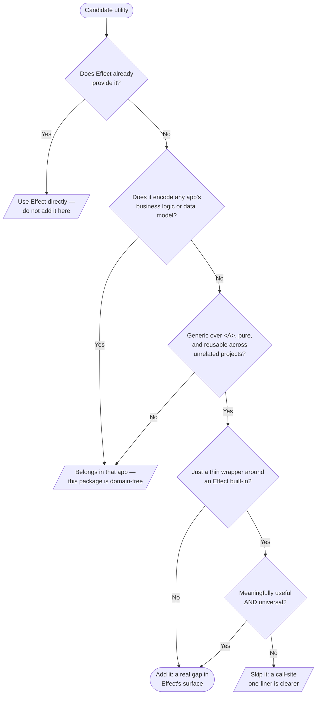

# @nunofyobiz/effect-extras

Generic, framework-agnostic extensions of the [Effect](https://effect.website)
standard library. These are the `*X` utility modules — `ArrayX`, `OptionX`,
`RecordX`, `StructX`, and friends — that extend Effect's own modules with small,
universal patterns used repeatedly across projects.

Each module is named after the Effect (or native) module it extends, suffixed
with `X`: `ArrayX` extends `Array`, `OptionX` extends `Option`, and so on. They
are pure, generic, and carry **no** domain or framework knowledge — that is the
whole point, and the bar every addition has to clear (see
[What belongs here](#what-belongs-here)).

```ts
import { ArrayX, OptionX, RecordX, StructX, nn } from "@nunofyobiz/effect-extras";
```

## Install

```sh
pnpm add @nunofyobiz/effect-extras
```

`effect` is a **peer dependency** — your project must already depend on a
compatible version of `effect`. This package extends Effect; it does not bundle
it.

## What belongs here

This package has exactly one job: hold the generic `*X` helpers that extend
Effect with patterns worth reusing **everywhere**. The danger with a "utils"
package is scope creep, so the bar for adding something is deliberately high.

A utility belongs here only if **all** of these hold:

1. **It is not already in Effect.** If `effect` (or an `@effect/*` package)
   already does it, use that directly. Check the [Effect docs](https://effect.website)
   first — the built-in modules (`Array`, `Option`, `Record`, `Predicate`,
   `String`, `Number`, `Order`, `Result`, `Match`, `Struct`, …) are wide and
   well-tested, and most "manipulate this shape" needs already exist there.
2. **It is generic and pure.** It operates on type parameters (`<A>`), has no
   side effects, no mutations, and would make sense in a project that shares
   nothing with yours.
3. **It carries zero app knowledge.** It never references a specific business
   domain or data model (no `Project`, `User`, `Timeline`, …), and never encodes
   product rules. Domain-shaped helpers live in the app that owns the domain —
   not here. **This is the hard line.**
4. **If it is a thin wrapper around Effect built-ins, it earns its place.** A
   small convenience wrapper is only worth adding when it is _meaningfully
   useful_ **and** _universal_. If a one-liner at the call site is just as clear,
   don't wrap it — the indirection costs more than it saves.

### Decision flowchart



### Does NOT belong here

- Anything tied to a domain model, a database row, an API shape, or product copy.
- Anything that imports a framework (React, Next, a UI kit) or `node:*` built-ins
  in a way that assumes a runtime — these helpers must work anywhere Effect works.
- A wrapper that exists only to rename an Effect function, or to save a single
  obvious line. Reach for it at the call site instead.
- A control-flow combinator Effect already ships (`sequence`, `when`, `unless`,
  …). Extend Effect's _data_ surface, don't re-implement its control flow.

When you are unsure, leave it at the call site. A helper graduates into this
package the moment a **second, unrelated** call site wants the same generic
shape — not before.

## Modules

Each module is exported as a namespace from the package root:

| Module         | Extends / purpose                                                          |
| -------------- | -------------------------------------------------------------------------- |
| `ArrayX`       | Array helpers (grouping, ordered insertion, `These`-zip)                   |
| `BigIntX`      | BigInt helpers (`toNumberOrThrow`)                                         |
| `BooleanX`     | Boolean helpers                                                            |
| `DurationX`    | Duration / DateTime diff helpers                                           |
| `EffectX`      | Effect bridges (`flattenOption`, `fromOptionOrElse`, `tryUntil`)           |
| `FormDataX`    | Schema-based `FormData` parsing                                            |
| `MapX`         | Native `Map` helpers                                                       |
| `NonNullableX` | Non-nullable assertions (`fromNullableOrThrow`, exported as `nn`)          |
| `NumberX`      | Number helpers                                                             |
| `OptionX`      | Option helpers and rendering bridges                                       |
| `OrderX`       | `Order` helpers (`rankedEnum`)                                             |
| `PredicateX`   | Compound predicates (`isNonEmptyString`, `matchRefine`)                    |
| `PromiseX`     | Promise helpers                                                            |
| `RecordX`      | Record manipulation (`modifyIfExists`, `upsert`, `collectBy`)              |
| `ResultX`      | `Result` bridges (`fromOption`)                                            |
| `SchemaX`      | Effect Schema extensions (`pick`/`omit`/`partial`, branded strings)        |
| `SetX`         | Native `Set` helpers                                                       |
| `StringX`      | String helpers                                                            |
| `StructX`      | Conditional object-field construction (`defined`, `filterDefined`, `some`) |
| `These`        | `These` data type (both / this / that)                                     |

## Development

```sh
pnpm install
pnpm tc          # typecheck (src + tests)
pnpm lint        # ESLint (formatting included via eslint-plugin-prettier)
pnpm test        # vitest run
pnpm build       # emit dist/ (ESM + bundled .d.ts) via tsup
pnpm knip        # unused code / deps
pnpm check-all   # all of the above, in CI order
```

Every public function needs exhaustive tests — every branch and edge case
(empty, single-element, boundary), plus type-level correctness where the whole
point of the helper is type narrowing. Generic utilities are consumed by every
layer above them and have no domain context to specify them other than their
tests, so the tests _are_ the spec.

See [AGENTS.md](./AGENTS.md) for the full contributor/agent guide (Effect
conventions, the `*X` module + barrel pattern, no `as` casts, commit/PR/release
workflow).

## Releasing

This package uses [Changesets](https://github.com/changesets/changesets).

1. Add a changeset describing your change: `pnpm changeset`.
2. Commit it and push/merge to `main`.
3. The **Release** workflow opens a "Version Packages" PR. Merging it publishes
   to npm (with provenance) and creates a GitHub release.
