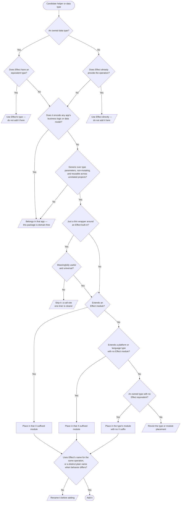

# @nunofyobiz/effect-extras

[](https://www.npmjs.com/package/@nunofyobiz/effect-extras)
[](https://github.com/nunofyobiz/effect-extras/actions/workflows/ci.yml)
[](https://nunofyobiz.github.io/effect-extras/)
[](./LICENSE)

📖 **[API reference & docs →](https://nunofyobiz.github.io/effect-extras/)**

Generic, framework-agnostic extensions of the [Effect](https://effect.website)
standard library. These are the `*X` utility modules — `ArrayX`, `OptionX`,
`RecordX`, `StructX`, and friends — that extend Effect's own modules with small,
universal patterns used repeatedly across projects.

Each module is named after the Effect (or native) module it extends, suffixed
with `X`: `ArrayX` extends `Array`, `OptionX` extends `Option`, and so on. They
are pure, generic, and carry **no** domain or framework knowledge — that is the
whole point, and the bar every addition has to clear (see
[What belongs here](#what-belongs-here)).

> **Requires [Effect v4](https://effect.website)** (peer
> `effect@^4.0.0-rc.111`).

```ts
import {
  ArrayX,
  OptionX,
  RecordX,
  StructX,
  nn,
} from "@nunofyobiz/effect-extras";
```

## Install

```sh
pnpm add @nunofyobiz/effect-extras
```

`effect` is a **peer dependency** — your project must already depend on a
compatible version of `effect`. This package extends Effect; it does not bundle
it.

## Tree-shaking

The package is **side-effect free** (`"sideEffects": false`) and is built — the
same way [Effect](https://effect.website) is — with `tsc` (one ESM file per
module, no bundling) plus Babel's
[`annotate-pure-calls`](https://github.com/Andarist/babel-plugin-annotate-pure-calls)
pass, which stamps every helper `/*#__PURE__*/`. A bundler therefore keeps only
what you actually use. Three import styles, finest-grained first:

```ts
// Subpath, named — only this function (and its real deps) reach your bundle.
import { compactNullable } from "@nunofyobiz/effect-extras/ArrayX";

// Subpath, namespace — `ArrayX.*`, tree-shaken per function (Effect-style).
import * as ArrayX from "@nunofyobiz/effect-extras/ArrayX";

// Root barrel — convenient; unused *modules* are shaken away, but a module you
// touch is kept whole (per-module granularity).
import { ArrayX } from "@nunofyobiz/effect-extras";
```

Measured (minified + brotli, `effect` externalized): a single function lands at
**~40 B**, a whole module at **~1 kB**, the entire library at **~4.4 kB** — so a
subpath import pays for what it uses, not the library. Budgets are enforced in CI
via [size-limit](https://github.com/ai/size-limit); packaging correctness via
[publint](https://publint.dev).

## What belongs here

effect-extras is a mathematical, functional-programming data-manipulation
library that supplements Effect v4. It has no domain logic, domain types, or
app-specific shapes. The danger with a "utils" package is scope creep, so the
bar for adding something is deliberately high.

Before adding, changing, or extracting a helper, use this test from top to
bottom. A utility belongs here only if **all** of these hold:

1. **Effect does not already provide the operation or an equivalent data type.**
   If `effect` (or an `@effect/*` package) already does it, use that. The built-in
   modules (`Array`, `Option`, `Record`, `Predicate`, `String`, `Number`, `Order`,
   `Result`, `Match`, `Struct`, …) are wide — check them first. Read the installed
   `node_modules/effect` types when you need the exact local API signature.
2. **It is generic and pure.** It is one common data manipulation over type
   parameters such as `<A>` and `<B>`, has no mutation, and makes sense in a
   project that shares nothing with yours. An explicit observer such as
   `OptionX.inspectSome` preserves its input while invoking the callback it was
   given.
3. **It carries zero app knowledge.** It never references a business domain or
   data model (`Project`, `User`, `Timeline`, …) and never encodes product rules.
   **This is the hard line** — domain-shaped helpers live in the app that owns the
   domain.
4. **A thin wrapper around Effect built-ins must earn its place.** Add one only when
   it is _meaningfully useful_ **and** _universal_. If a one-liner at the call
   site is just as clear, do not wrap it.

When a new or changed helper takes a data argument plus other arguments, use
`dual`: declare the data-last overload first and the data-first overload second.

Name a helper after the plain operation it performs: `mapError`, not `mapLeft`;
`mapInput`, not `contramap`; and `inspect`, not `tap`. When it does the same
operation as an Effect combinator, reuse Effect's name: `mapError`, `mapInput`,
and `NonNullableX.lift` follow that rule. When its behavior differs from
Effect's same-named combinator, give it a distinct, plain name.
Effect v4 itself ships `tap` on `Effect`, `Option`, `Result`, and other modules,
plus `lift*` helpers such as `Option.liftPredicate`; `OptionX.inspectSome` is an
observer with different behavior, so it is not called `tap`. Never introduce
functional-programming theory jargon such as `contramap` or `bimap`, or use
Left/Right to mean error/success.

Put a helper in a module named after the type it supplements: a `*X` module for
an Effect module; a `*X` module for a platform or language type for which Effect
has no module; or, only when Effect has no equivalent, a module named for a data
type this package owns with no `X`. `InclusiveOr` and `WarnResult` are the current
owned-type modules. The Left/Right names in `InclusiveOr` describe its variants,
and `ArrayX.mapRightAccum` and `NumberX.padLeftZeroes` use positional directions;
those names are deliberate carve-outs.

### Decision flowchart


```mermaid
flowchart TD
    A([Candidate helper or data type]) --> B{An owned data type?}
    B -- Yes --> C{Does Effect have an<br/>equivalent type?}
    C -- Yes --> R1[/Use Effect's type —<br/>do not add it here/]
    C -- No --> D{Does it encode any app's<br/>business logic or data model?}
    B -- No --> E{Does Effect already<br/>provide the operation?}
    E -- Yes --> R2[/Use Effect directly —<br/>do not add it here/]
    E -- No --> D
    D -- Yes --> R3[/Belongs in that app —<br/>this package is domain-free/]
    D -- No --> F{Generic over type parameters, non-mutating,<br/>and reusable across unrelated projects?}
    F -- No --> R3
    F -- Yes --> G{Just a thin wrapper around<br/>an Effect built-in?}
    G -- Yes --> H{Meaningfully useful<br/>and universal?}
    H -- No --> R4[/Skip it: a call-site<br/>one-liner is clearer/]
    H -- Yes --> I{Extends an<br/>Effect module?}
    G -- No --> I
    I -- Yes --> J[Place in that X-suffixed module]
    I -- No --> K{Extends a platform or language type<br/>with no Effect module?}
    K -- Yes --> L[Place in that X-suffixed module]
    K -- No --> M{An owned type with no<br/>Effect equivalent?}
    M -- Yes --> N[Place in the type's module<br/>with no X suffix]
    M -- No --> R5[/Revisit the type or module placement/]
    J --> O{Uses Effect's name for the same operation,<br/>or a distinct plain name when behavior differs?}
    L --> O
    N --> O
    O -- No --> R6[/Rename it before adding/]
    O -- Yes --> OK([Add it])
```

### Does NOT belong here

- Anything tied to a domain model, a database row, an API shape, or product copy.
- Anything that imports a framework (React, Next, a UI kit) or assumes a runtime.
- A wrapper that just renames an Effect function or saves one obvious line.
- A control-flow combinator Effect already ships (`sequence`, `when`, `unless`).
  Extend Effect's _data_ surface, not its control flow.

When you are unsure, leave it at the call site. A helper graduates into this
package when a **second, unrelated** call site wants the same generic shape — a
call site in a separate, unrelated consuming repository counts as that second
call site.

## Modules

Each module is exported as a namespace — from the package root and from a
matching subpath (`@nunofyobiz/effect-extras/ArrayX`); see
[Tree-shaking](#tree-shaking):

| Module         | Extends / purpose                                                          |
| -------------- | -------------------------------------------------------------------------- |
| `ArrayX`       | Array helpers (ordered insertion, nullable compaction)                     |
| `BigIntX`      | BigInt helpers (`toNumberOrThrow`)                                         |
| `BooleanX`     | Boolean helpers                                                            |
| `DurationX`    | Duration / DateTime diff helpers                                           |
| `EffectX`      | Effect utilities (`flattenOption`, `tryUntil`)                             |
| `FormDataX`    | Schema-based `FormData` parsing                                            |
| `InclusiveOr`  | Inclusive-or of a `left` and/or `right` — terminology-free `WarnResult`    |
| `MapX`         | Native `Map` helpers                                                       |
| `NonNullableX` | Non-nullable assertions (`fromNullableOrThrow`, exported as `nn`)          |
| `NumberX`      | Number helpers                                                             |
| `OptionX`      | Option helpers and rendering bridges                                       |
| `OrderX`       | `Order` helpers (`rankedEnum`)                                             |
| `PredicateX`   | Compound predicates (`isNonEmptyString`, `matchRefine`)                    |
| `PromiseX`     | Promise helpers                                                            |
| `RecordX`      | Record manipulation (`modifyIfExists`, `upsert`, `collectBy`)              |
| `ResultX`      | `Result` bridges (`fromOption`)                                            |
| `SchemaX`      | Effect Schema extensions (`pick`/`omit`/`partial`, branded strings)        |
| `SetX`         | Native `Set` helpers                                                       |
| `StringX`      | String helpers                                                             |
| `StructX`      | Conditional object-field construction (`defined`, `filterDefined`, `some`) |
| `WarnResult`   | Inclusive-or result: a success value, warnings, or both                    |

## Development

```sh
pnpm install
pnpm tc          # typecheck (src + tests)
pnpm lint        # ESLint (formatting included via eslint-plugin-prettier)
pnpm test        # vitest run
pnpm build       # emit dist/ (one ESM file + .d.ts per module): tsc + babel
pnpm publint     # validate packaging (exports map, types, ESM) — needs a build
pnpm treeshake   # enforce per-function tree-shaking budgets (size-limit) — needs a build
pnpm knip        # unused code / deps
pnpm docgen      # type-check JSDoc examples + regenerate docs/
pnpm check-all   # all of the above, in CI order
```

Every public function needs exhaustive tests — every branch and edge case
(empty, single-element, boundary), plus type-level correctness where the whole
point of the helper is type narrowing. Generic utilities are consumed by every
layer above them and have no domain context to specify them other than their
tests, so the tests _are_ the spec.

See [AGENTS.md](./AGENTS.md) for the full contributor/agent guide (Effect
conventions, the `*X` module + barrel pattern, no `as` casts, commit/PR/release
workflow).

## Releasing

This package uses [Changesets](https://github.com/changesets/changesets).

1. Add a changeset describing your change: `pnpm changeset`.
2. Commit it and push/merge to `main`.
3. The **Release** workflow opens a shared "Version Packages" PR that bumps the
   version and rolls up the changelog. Auto-merge is best-effort: whoever cuts
   the release must ensure that PR is merged after its required CI passes.
   ampm's deploy step follows the [release verification checklist](.ampm/steps/deploy.md).
   Its merge runs the publishing workflow, which must succeed before the exact
   derived version can be verified on npm (with provenance) and in a matching
   GitHub release. Never publish locally or edit versions by hand.
