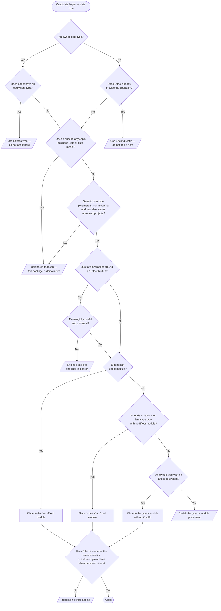

# What belongs here

**This is the most important section in this guide — the prime directive for any work in this
repo.** effect-extras is a mathematical, functional-programming data-manipulation library that
supplements Effect v4. It has no domain logic, domain types, or app-specific shapes. Its entire
value is its restraint: a "utils" grab-bag that accretes whatever is convenient is worse than no
package at all.

## The test

Before adding, changing, or extracting a helper, use this test from top to bottom. A utility belongs
here only if **all** of these hold:

1. **Effect does not already provide the operation or an equivalent data type.** If `effect` (or an
   `@effect/*` package) already does it, use that. The built-in modules (`Array`, `Option`, `Record`,
   `Predicate`, `String`, `Number`, `Order`, `Result`, `Match`, `Struct`, …) are wide — check them
   first. Read the installed `node_modules/effect` types when you need the exact local API signature.
2. **It is generic and pure.** It is one common data manipulation over type parameters such as
   `<A>` and `<B>`, has no mutation, and makes sense in a project that shares nothing with yours.
   An explicit observer such as `OptionX.inspectSome` preserves its input while invoking the callback
   it was given.
3. **It carries zero app knowledge.** It never references a business domain or data model
   (`Project`, `User`, `Timeline`, …) and never encodes product rules. **This is the hard line** —
   domain-shaped helpers live in the app that owns the domain.
4. **A thin wrapper around Effect built-ins must earn its place.** Add one only when it is
   _meaningfully useful_ **and** _universal_. If a one-liner at the call site is just as clear,
   do not wrap it.

When a new or changed helper takes a data argument plus other arguments, use `dual`: declare the
data-last overload first and the data-first overload second. This gives callers both a pipeable and a
direct form without changing the operation.

### Names and modules

Name a helper after the plain operation it performs: `mapError`, not `mapLeft`; `mapInput`, not
`contramap`; and `inspect`, not `tap`. When it does the same operation as an Effect combinator, reuse
Effect's name: `mapError`, `mapInput`, and `NonNullableX.lift` follow that rule. When its behavior
differs from Effect's same-named combinator, give it a distinct, plain name. Effect v4 itself ships
`tap` on `Effect`, `Option`, `Result`, and other modules, plus `lift*` helpers such as
`Option.liftPredicate`; `OptionX.inspectSome` is an observer with different behavior, so it is not
called `tap`. Never introduce functional-programming theory jargon such as `contramap` or `bimap`, or
use Left/Right to mean error/success.

Put the helper in a module named after the type it supplements. Every public data module currently in
`src/` — excluding the root `index.ts` barrel — fits exactly one of these categories:

1. **An Effect-module extension:** a `*X` module for an Effect module — `ArrayX`, `BigIntX`,
   `BooleanX`, `DurationX`, `EffectX`, `NumberX`, `OptionX`, `OrderX`, `PredicateX`, `RecordX`,
   `ResultX`, `SchemaX`, `StringX`, and `StructX`.
2. **A platform or language-type extension:** a `*X` module for a platform or language type for
   which Effect has no module — `MapX`, `SetX`, `PromiseX`, `FormDataX`, and `NonNullableX`.
   `NonNullableX` extends TypeScript's `NonNullable` language type.
3. **A type owned by this package:** a module named for its data type, with no `X` — `InclusiveOr`
   and `WarnResult`.

Prefer Effect's own types. Define an owned data type (category 3) only when Effect ships no
equivalent.

The no-jargon rule has deliberate carve-outs. Every `InclusiveOr` export or type named for that
type's own Left/Right variants — including `mapLeft`, `mapRight`, `matchLeft`, and `LeftOnly` — keeps
its name; Left and Right are the type's variants, not functional-programming jargon. In
`ArrayX.mapRightAccum`, Right means right-to-left, and in `NumberX.padLeftZeroes`, Left names the
side being padded. These positional names also stay.

**Does NOT belong:** anything tied to a domain model / DB row / API shape / product copy; anything
importing a framework or assuming a runtime; a wrapper that just renames an Effect function or saves
one obvious line; or a control-flow combinator Effect already ships (`sequence`, `when`, `unless`).
Extend Effect's _data_ surface, not its control flow.

When unsure, leave it at the call site rather than exporting it. A **second, unrelated** call site
is strong evidence that a helper should graduate into this package — a call site in a separate,
unrelated consuming repository counts as that second call site. A public helper can also belong
sooner when it gives a common generic operation a useful name or has a clear expectation of reuse
across unrelated consumers that are not visible here.
