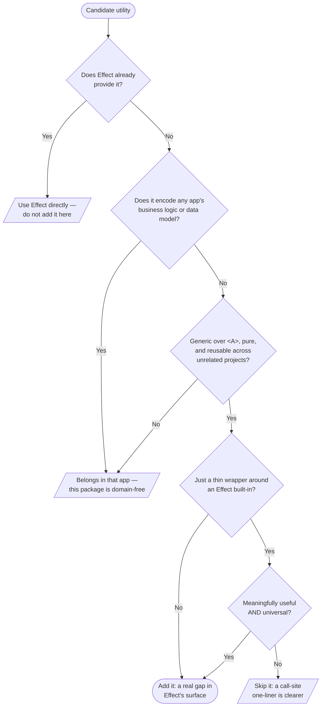

# What belongs here

**This is the most important section in this guide — the prime directive for any work in this
repo.** It is the whole job of the package and the one decision you'll make most often. The package's
entire value is its restraint: a "utils" grab-bag that accretes whatever is convenient is worse than
no package at all. So before you add, change, or extract anything, it must clear this bar. A utility
belongs here only if **all** of these hold:

1. **It is not already in Effect.** If `effect` (or an `@effect/*` package) already does it, use
   that. The built-in modules (`Array`, `Option`, `Record`, `Predicate`, `String`, `Number`,
   `Order`, `Result`, `Match`, `Struct`, …) are wide — check them first. Read the installed
   `node_modules/effect` types when you need the exact local API signature.
2. **It is generic and pure.** Operates on type parameters (`<A>`), no side effects, no mutations,
   and would make sense in a project that shares nothing with yours.
3. **It carries zero app knowledge.** It never references a business domain or data model
   (`Project`, `User`, `Timeline`, …) and never encodes product rules. **This is the hard line** —
   domain-shaped helpers live in the app that owns the domain.
4. **A thin wrapper around Effect built-ins must earn its place.** Only add one when it is
   _meaningfully useful_ **and** _universal_. If a one-liner at the call site is just as clear,
   don't wrap it.

**Does NOT belong:** anything tied to a domain model / DB row / API shape / product copy; anything
importing a framework or assuming a runtime; a wrapper that just renames an Effect function or
saves one obvious line; or a control-flow combinator Effect already ships (`sequence`, `when`,
`unless`). Extend Effect's _data_ surface, not its control flow.

When unsure, leave it at the call site. A helper graduates into this package the moment a
**second, unrelated** call site wants the same generic shape — not before.
